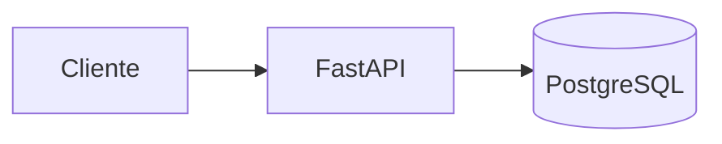
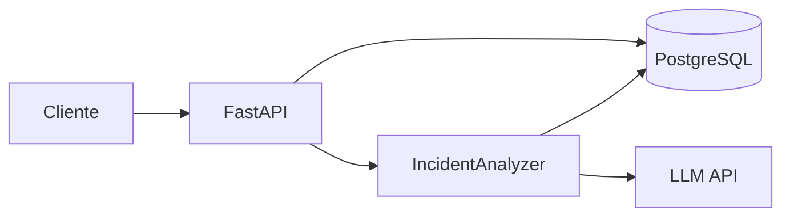

# Arquitectura evolutiva

## Estado inicial y Fase 1

La API valida peticiones, coordina crear/consultar/listar incidentes y devuelve respuestas HTTP. SQLAlchemy administra acceso a datos; Alembic versiona el esquema. El contrato de Fase 1 no incluye análisis con AI ni operaciones de actualizar o borrar. Los límites entre rutas, servicio, repositorio y persistencia se concretan en los hitos 3 a 5, sin crear módulos genéricos sin usuarios reales.

Modelo inicial propuesto en Notion: `id`, `job_name`, `status`, `log`, `exit_code`, `created_at`, `analysis_status`, `probable_cause`, `evidence`, `suggested_actions`. Tipos, nulabilidad, defaults y límites se decidirán en el Hito 4. Los campos de análisis podrán quedar vacíos durante la Fase 1 según el contrato que se apruebe.

El repositorio contiene hoy código en `backend/`, no en `src/`. Esta documentación adopta la jerarquía objetivo para los documentos, pero no describe `src/` como implementación activa.

## Fase 2: análisis con LLM

`IncidentAnalyzer` aísla el proveedor, convierte logs y metadata en una solicitud y valida una respuesta estructurada con causa probable, confianza, evidencia y acciones. Registrar modelo, latencia y estado. Probar con un fake del proveedor. Tratar logs como datos no confiables y mantener secretos fuera de Git. Ver [003-llm-abstraction.md](decisions/003-llm-abstraction.md).

## Evolución posterior

- **RAG:** runbooks → chunks → embeddings → pgvector → contexto recuperado → analizador. Conservar referencias a documentos y fragmentos usados.
- **Tool calling:** el modelo solicita funciones de consulta que ya existen como servicios Python; la aplicación valida argumentos, permisos y límites y registra cada llamada.
- **Event-driven:** cliente → FastAPI → PostgreSQL/cola → worker → LLM/RAG → PostgreSQL. Definir estados `pending`, `processing`, `completed`, `failed`, correlation ID, retries con backoff, idempotencia y tratamiento de mensajes fallidos. Elegir una cola simple antes de evaluar Kafka.
- **Operación:** dataset de incidentes, evaluaciones de respuesta y retrieval, latencia, costo, errores, readiness y observabilidad. Cloud se evalúa después del MVP.

La arquitectura se amplía únicamente ante un problema medido o reproducible. Las decisiones abiertas se documentan en [decisions/](decisions/).
