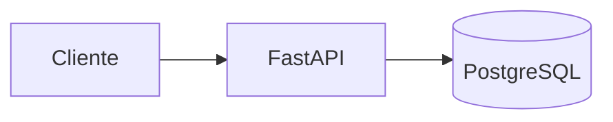
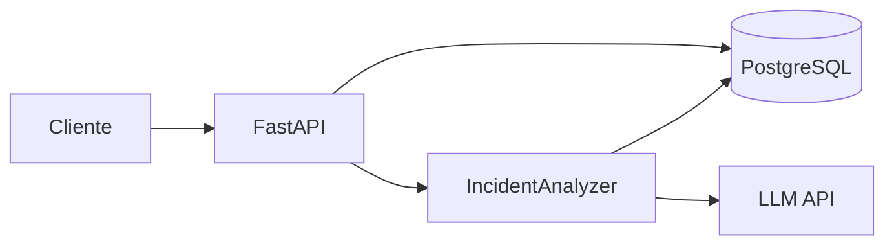

# Arquitectura evolutiva

## Estado inicial y Fase 1

La API valida peticiones, coordina crear/consultar/listar incidentes y devuelve respuestas HTTP. SQLAlchemy administra acceso a datos; Alembic versiona el esquema. El contrato de Fase 1 no incluye análisis con AI ni operaciones de actualizar o borrar. Los límites entre rutas, servicio, repositorio y persistencia se concretan en los hitos 3 a 5, sin crear módulos genéricos sin usuarios reales.

El contrato implementado de Fase 1 contiene `id`, `job_name`, `log`, `exit_code` y `created_at`. `job_name` y `log` son entrada obligatoria del cliente; `exit_code` es opcional. El servidor genera el UUID y PostgreSQL asigna la fecha. Se excluye `status` y se guarda `log` en PostgreSQL con un máximo de 64 KiB en UTF-8. Los campos de análisis se reservan para Fase 2; ver [004-incident-contract.md](decisions/004-incident-contract.md).

Las rutas de `backend/app/main.py` validan los contratos de `incident.py` y llaman a `incident_service.py`. `get_session()` entrega una sesión por petición, revierte ante un fallo y siempre la cierra. La creación confirma la transacción en el servicio antes de responder; el listado ordena por fecha e ID descendentes y aplica `limit`/`offset`. Alembic reconstruye el esquema mediante una migración versionada. Los errores, la configuración de arranque y el logging JSON se describen en [005-errors-config-logging.md](decisions/005-errors-config-logging.md).

El repositorio contiene hoy código en `backend/`, no en `src/`. Esta documentación adopta la jerarquía objetivo para los documentos, pero no describe `src/` como implementación activa.

## Fase 2: análisis con LLM

`IncidentAnalyzer` aísla el proveedor, convierte logs y metadata en una solicitud y valida una respuesta estructurada con causa probable, confianza, evidencia y acciones. Registrar modelo, latencia y estado. Probar con un fake del proveedor. Tratar logs como datos no confiables y mantener secretos fuera de Git. Ver [003-llm-abstraction.md](decisions/003-llm-abstraction.md).

## Evolución posterior

- **RAG:** runbooks → chunks → embeddings → pgvector → contexto recuperado → analizador. Conservar referencias a documentos y fragmentos usados.
- **Tool calling:** el modelo solicita funciones de consulta que ya existen como servicios Python; la aplicación valida argumentos, permisos y límites y registra cada llamada.
- **Event-driven:** cliente → FastAPI → PostgreSQL/cola → worker → LLM/RAG → PostgreSQL. Definir estados `pending`, `processing`, `completed`, `failed`, correlation ID, retries con backoff, idempotencia y tratamiento de mensajes fallidos. Elegir una cola simple antes de evaluar Kafka.
- **Operación:** dataset de incidentes, evaluaciones de respuesta y retrieval, latencia, costo, errores, readiness y observabilidad. Cloud se evalúa después del MVP.

La arquitectura se amplía únicamente ante un problema medido o reproducible. Las decisiones abiertas se documentan en [decisions/](decisions/).
